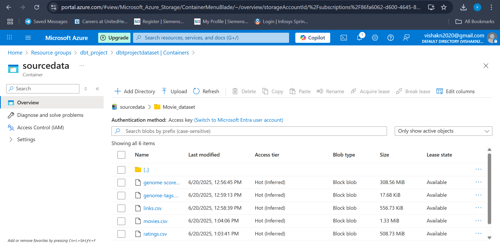

# 🎬 Movielens Data Analytics project using Data Build Tool
This project is developed to perform the movie analysis on the historical data. In this the data is sourced, cleaned, and loaded in the data warehouse. From there, the data is analyzed to find patterns, and also we can build a movie recommendation system.

## 📊 Project flow:
📁 ADLS → 🚰 Airbyte → ❄ Snowflake[🟫 Bronze] --(DBT)-→ ❄ Snowflake[🥈 Silver] --(DBT)-→  ❄ Snowflake[🥇 GOLD]

In this project, I have connected the Gold layer with **AskYourDatabase**, enabling text-to-SQL querying 🗣️➡️📊 without the need to manually write SQL scripts 📝❌.

- First the data will be in the Azure Data Lake
- Then using Airbyte (EL Tool), data will be ingested and loaded into Snowflake (Bronze) **OR**
- In Snowflake, creating a stage would help to fetch the data from the ADLS container
- From there, data is transformed using DBT and moved through different layers,
- The final output will be in Fact and Dimensional Tables (in the Gold layer)

---

## 🧰 Tech Stack Learned:
- 🛠️ DBT (Data Build Tool)
- ☁️ Azure Data Lake
- ❄️ Snowflake
- 🔄 Airbyte
- 🐙 GitHub
- 🤖 AskYourDatabase

---

## Getting started 

Steps to intiate the project

### Step 1: Create the required Installations
- Install the DBT account locally
- Create account in **Azure Cloud**, **Snowflake**, **Airbyte**, **AskYourDatabase**

### Step 2: Create the Azure Container (ADLS)
- Creating the conatiner is necessary, that act as a source in this project

### Step 3: Create the Airbyte Connection or Creata a Stage in Snowflake
- Implement a connection between Azure container and Snowflake to transfer the data **OR**
- Create a Stage in Snowfalke with ADLS and copy the file from ADLS to Snowflake
- Make Sure to load the data into the bronze Schema

### Step 3: Create database and schema in the Snowflake
- Create a new database (`DBT Project`)
- Create schema `MOVIE_DATASET_BRONZE`, `MOVIE_DATASET_SIVLER`, `MOVIE_DATASET_GOLD`
  
### Step 4: Create dbt models (which load the data into the `MOVIE_DATASET_SIVLER`)
- Create a folder **dbt_models_silver** under the models folder
- Creata dbt models with select command and make some changes  like cleaning and changing some naming convention
- Source of the model should be the Bronze data from the Snowflake
- Run the dbt models and it should be loading the data into the Silver layer of Snowflake

- **📌 Notes**
- Define sources in the source.yml file to allocate source storage.
- To load data into a specific storage, update the schema value in the dbt_project.yml file.
- To enable custom schema logic, create the appropriate macro (UDF) script in the macros/ directory.

--

### Step 4: Create dbt models (which load the data into the `MOVIE_DATASET_GOLD`)
- Create a folder **dbt_models_gold** under the models folder
- Within that creating a dim and fact folder

#### DIM Models
- Create a dim_genome_tags, source_genome_tags will be the source
- Creata a dim_movies, where joining both source_movies and source_links, deriving new column RELEASED_YEAR, IS_MULTI_GENRE
- Create dim_users, here joining the source_ratings and user_information which is stored in the seeds of dbt.

#### Fact Models
- Create a fact_genome_scores, source_genome_scores will be the source
- Creata a fact_ratings with incremental materialization, that is based on the condition **RATING_TIMESTAMP >= (SELECT MAX(RATING_TIMESTAMP)**, - - new data will be loaded and existing data will updated to the fact_ratings table in the gold_layer 
- Create a fact_tags, source_tags will be the source
- Source of the model should be the Silver layer data from the Snowflake
- Run the dbt models and it should be loading the data into the Gold layer of Snowflake

- **📌 Notes**
- same as the silver folder, source and customer schema is applicable here.
  
Finally, there will be Galaxy Schema model in the Gold layer of the Snowflake. 

### Step 5: Connecting the Snowflake schema with AskYourDatabase
- In the AskYourDatabase, create SQL AI bot with Snowflake Goldlayer as the Datasource

 ### 🚀 USAGE
 ##### Workflow of the project

 - Files will be loaded in the ADLS containers
 - Transfering the data using Airbyte or Snowfalke Stage
 - Data transformation by DBT from `Bronze to Silver` and `Silver to Gold`
 - Text-to-SQL querying with the help of AskYourDatabase.

  

